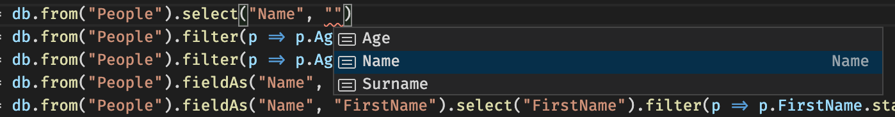
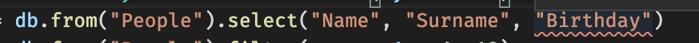
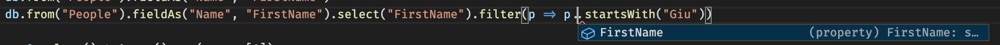

# A type-safe, in-memory database for TypeScript
_By Dr. Giuseppe Maggiore_


In modern Single Page Application (SPA) development, we have a lot of data processing we need to perform locally. One of the biggest triggers for this article, is the following scenario\:

> For an awesome [online food ordering platform](https://beren.nl), we receive the following data from a Graph API\: `Restaurants -> Products -> [Categories, Options]` (thus we get a list of restaurants, each with a list of products inside, and each product contains a list of categories it falls under, and the options available for that product). 
> This appears to be the fastest query that the API supports, also because products are found in many categories (thus we get less duplicates!).
> The React renderer needs to sort products by category, and we also don't care about the restaurants because we are fetching the data for a single restaurant anyway. We need to turn the result of the query around, so that it looks like this\: `Categories -> Products -> Options`.
> And so, a tale of `Map`s, `Set`s, `flatMap`, etc. begins.

The resulting data processing code looks roughly like this\:

```ts
let res = restaurants.filter(restaurant => (restaurant.Restaurant_WaitingTimes.first() != undefined) && (restaurant.Restaurant_WaitingTimes.first().WaitingTimes != null))
      .map(restaurant => ({...restaurant,
                              PostCodeRanges: restaurant.Restaurant_PostCodeRange.flatMap(rpcr => rpcr.PostCodeRange.filter(pcr => pcr.Active).map(pcr =>
                              DeliveryClosingTimes: restaurant.Restaurant_DeliveryClosingTime.flatMap(r_dct => r_dct.DeliveryClosingTime.map(dct =>
                              DeliveryOpeningTimes: restaurant.Restaurant_DeliveryTimes.flatMap(r_dt => r_dt.DeliveryTimes.map(dt => ...),
                              PickupClosingTimes: restaurant.Restaurant_PickupClosingTime.flatMap(r_pct => r_pct.PickupClosingTime.map(pct =>
                              ...))).toList(),
                              PickupOpeningTimes: restaurant.Restaurant_PickupTimes.flatMap(r_pt => r_pt.PickupTimes.map(pt =>
                                        DeliveryPayMethods: restaurant.DeliveryRestaurant_DeliveryPayMethod.sortBy(dr_dpm => dr_dpm.DeliveryPayMethodId).flatMap(dr_dpm => dr_dpm.PayMethod.map(pm => ({Method: pm.Method, DisplayTitle: pm.DisplayTitle}))).toList(),
                                        PickUpPayMethods: restaurant.PickUpRestaurant_PickUpPayMethod.sortBy(pur_pupm => pur_pupm.PickUpPayMethodId).flatMap(pur_pupm => pur_pupm.PayMethod.map(pm => ({Method: pm.Method, DisplayTitle: pm.DisplayTitle}))).toList()
                              ...)

```

Notice the nesting of multiple `flatMap`, `map`, and `filter` operators. While I am personally very happy that developers in my team are using functional code, which is a bit more guaranteed to work properly than working with nested imperative containers, I have to say\: this stuff is complex!

Perhaps you recognize this sort of challenge. While there may not be anything exceptionally complex about this situation, and the code that is needed in order to tackle it, it will still be quite a lot of tedious work. The distance between explaining what needs to be done, and the code that does it, is also quite annoying\: ideally, we want declarative code that almost reads like a description of a user story, but in this case, programmers reading and modifying the code must drown in technicality about data structure processing and lookups. *This  situation is not ideal*.

For this reason, I embarked on a journey to define a library for declarative, client\-side data processing, that would make this sort of operation less painful, with easier to read code, and last but not least with all the support possible from the compiler.


## The underlying idea
Instead of processing data in this "raw" format, how about we sort it first into a sort of standard, and only then we reformat it and process it however we see fit? And as a standard, how about taking inspiration from both relational databases and Graph APIs? This way, we store data in a proven manner (entities and relations!) and we then access the data through simple, logical operators that convey the fact that entities and relations are indeed a graph.

The underlying containers will be offered by the awesome _immutablejs_ library, which features one of (the?) most complete collection libraries available nowadays on the market (and not only in the JavaScript world, but that is only my own opinion).

### A first example
We start by setting up a very simple database, comprised only of people. The definition of the types that make up the entities and the whole database will then look like this\:

```ts
interface Person {
    Name: string
    Surname: string
    Age: number
  }
```

Next, we define the "database" itself. We define a type (`MyEntities`) with a field for each table we want to store. Tables are declared with the generic `Entity` type, which takes as input the primary keys of the entity, the fields, and the relations\:

```ts
interface MyEntities {
  People: Entity<{ PersonId: number }, Person, {
  }, MyEntities>
}
```

Now, we fill up the database by creating an instance of it with sample data\:

```ts
const PersonId = Record({ PersonId: 0 })
    
const myEntities: MyEntities = {
  People: Entity<MyEntities>()(Map<Record<{ PersonId: number }>, Person>()
    .set(PersonId({ PersonId: 0 }), { Name: "John", Surname: "Doe", Age: 27 })
    .set(PersonId({ PersonId: 1 }), { Name: "Jane", Surname: "Doe", Age: 31 })
    .set(PersonId({ PersonId: 2 }), { Name: "Giuseppe", Surname: "Rossi", Age: 35})
    .set(PersonId({ PersonId: 3 }), { Name: "Giulia", Surname: "Verdi", Age: 34 })
    .set(PersonId({ PersonId: 4 }), { Name: "Reby", Surname: "Rossi", Age: 7 })
    .set(PersonId({ PersonId: 5 }), { Name: "Rechy", Surname: "Rossi", Age: 5 })
    .set(PersonId({ PersonId: 6 }), { Name: "Francis", Surname: "Dee Jay", Age: 35 })
  ,
  {
  })
}
```

> One minor oddity\: we have to use `Record` from _immutablejs_, otherwise the underlying constructs will complain. If only `TypeScript` supported *structural equality*...

Now we can instantiate the actual database, and run some queries on it!

```ts
const db: Database<MyEntities> = Database(myEntities)
```

Let's start with something easy. For each `Person`, we want their `Name` and `Surname`, thereby discarding the `Age`\:

```ts
const q0 = db.from("People").select("Name", "Surname")
```

This results in\:

```json
[
 {
  "Name": "John",
  "Surname": "Doe"
 },
 {
  "Name": "Jane",
  "Surname": "Doe"
 },
 ...
]
```

Let's filter all people with at least 18 years of `Age`\:


```ts
const q1 = db.from("People").filter(p => p.Age >= 18)
```

This results in\:

```json
[
 {
  "Name": "John",
  "Surname": "Doe",
  "Age": 27
 },
 {
  "Name": "Jane",
  "Surname": "Doe",
  "Age": 31
 },
 {
  "Name": "Giuseppe",
  "Surname": "Rossi",
  "Age": 35
 },
 {
  "Name": "Giulia",
  "Surname": "Verdi",
  "Age": 34
 },
 {
  "Name": "Francis",
  "Surname": "Dee Jay",
  "Age": 35
 }
]
```

We can obviously combine different operators in a chain. For example, after filtering, we can just select the `Name` attribute of each result\:

```ts
const q2 = db.from("People").filter(p => p.Age >= 18).select("Name")
```

Resulting in\:

```json
[
 {
  "Name": "John"
 },
 {
  "Name": "Jane"
 },
 {
  "Name": "Giuseppe"
 },
 {
  "Name": "Giulia"
 },
 {
  "Name": "Francis"
 }
]
```

We might also decide to rename fields. For example, suppose we need the `Name` of each person to become the `FirstName` attribute\:

```ts
const q3 = db.from("People").fieldAs("Name", "FirstName")
```

The result reflects this change in type\:

```json
[
 {
  "Surname": "Doe",
  "Age": 27,
  "FirstName": "John"
 },
 {
  "Surname": "Doe",
  "Age": 31,
  "FirstName": "Jane"
 },
...
]
```

Finally, we can mix all of these things together in a very big query. Imagination is the limit, not the library :)

```ts
const q4 = db.from("People").fieldAs("Name", "FirstName").select("FirstName").filter(p => p.FirstName.startsWith("Giu"))
```

Pretty neat, eh?


### How about type safety though?
So far, you might have noticed that we are using a lot of strings in our structures. Fortunately, TypeScript can be programmed in such a way as to understand that the strings we use for some inputs must be constrained to the keys/attributes of given types. This means that TypeScript will offer both input (via IntelliSense) and compiler validation to our code.

Here are a few of pictures illustrating this\:







Notice that every sort of validation that could be performed, is performed. The IDE is able to give us advice (and the compiler will actually enforce it, so this is not just cosmetic!) on available fields, will disallow non\-existing fields, and will even compose the types of the (intermediate) results such as the fact that a field rename removes the original field and adds the new one.

Making *structural* mistakes with this kind of support is close to impossible, and requires a lot of discipline and motivation :)

##  A beefier example

Let us now consider a more complex example, where we have three entities (`Person`, `Address`, and `City`), related to each other in the expected way (people live at addresses, which are located at cities).

We start with a definition of the datatypes of the database\:

```ts
interface Person {
  Name: string
  Surname: string
  Age: number
}

interface Address {
  Street: string
  Number: number
  Postcode: string
}

interface City {
  Name: string
  Population: number
}
```

We then define all the entities and relations of the database\:

```ts
interface MyEntities {
  People: Entity<{ PersonId: number }, Person, {
    Addresses: Relation<MyEntities, "People", "Addresses", "N-1">
  }, MyEntities>
  Addresses: Entity<{ AddressId: number }, Address, {
    Cities: Relation<MyEntities, "Addresses", "Cities", "N-1">,
    People: Inverted<EntityRelations<MyEntities["People"]>["Addresses"]>
  }, MyEntities>
  Cities: Entity<{ CityId: number }, City, {
    Addresses: Inverted<EntityRelations<MyEntities["Addresses"]>["Cities"]>
  }, MyEntities>
}
```

Notice that we are now specifying, for each entity, its relations. A relation can be defined directly, for example `Relation<MyEntities, "People", "Addresses", "N-1">` goes from `People` to `Addresses`, and 1 address is shared by multiple people. A relation can also be defined as the inversion of another relation, to avoid repetition; for example, `Inverted<EntityRelations<MyEntities["People"]>["Addresses"]>` simply fetches the `Addresses` relation of `People`, and turns it around.

We now instantiate all entities and relationships. I usually prefer to start with the relationships, but it is a matter of taste, and moreover this bit of the code should be automated away by a database setup utility that does this from the result of an API!

```ts
const PersonId = Record({ PersonId: 0 })
const AddressId = Record({ AddressId: 0 })
const CityId = Record({ CityId: 0 })

const personAddresses = Relation<MyEntities, "People", "Addresses", "N-1">(
  Map<Record<{ PersonId: number }>, Set<Record<{ AddressId: number }>>>()
    .set(PersonId({ PersonId: 0 }), Set<Record<{ AddressId: number }>>()
      .add(AddressId({ AddressId: 0 })))
    .set(PersonId({ PersonId: 1 }), Set<Record<{ AddressId: number }>>()
      .add(AddressId({ AddressId: 0 })))
    .set(PersonId({ PersonId: 2 }), Set<Record<{ AddressId: number }>>()
      .add(AddressId({ AddressId: 1 })))
    .set(PersonId({ PersonId: 3 }), Set<Record<{ AddressId: number }>>()
      .add(AddressId({ AddressId: 1 })))
    .set(PersonId({ PersonId: 4 }), Set<Record<{ AddressId: number }>>()
      .add(AddressId({ AddressId: 1 })))
    .set(PersonId({ PersonId: 5 }), Set<Record<{ AddressId: number }>>()
      .add(AddressId({ AddressId: 1 })))
    .set(PersonId({ PersonId: 6 }), Set<Record<{ AddressId: number }>>()
      .add(AddressId({ AddressId: 2 })))
)

const addressCities = Relation<MyEntities, "Addresses", "Cities", "N-1">(
  Map<Record<{ AddressId: number }>, Set<Record<{ CityId: number }>>>()
    .set(AddressId({ AddressId: 0 }), Set<Record<{ CityId: number }>>()
      .add(CityId({ CityId: 0 })))
    .set(AddressId({ AddressId: 1 }), Set<Record<{ CityId: number }>>()
      .add(CityId({ CityId: 1 })))
    .set(AddressId({ AddressId: 2 }), Set<Record<{ CityId: number }>>()
      .add(CityId({ CityId: 2 })))
)

const myEntities: MyEntities = {
  People: Entity<MyEntities>()(Map<Record<{ PersonId: number }>, Person>()
    .set(PersonId({ PersonId: 0 }), { Name: "John", Surname: "Doe", Age: 27 })
    .set(PersonId({ PersonId: 1 }), { Name: "Jane", Surname: "Doe", Age: 31 })
    .set(PersonId({ PersonId: 2 }), { Name: "Giuseppe", Surname: "Rossi", Age: 35})
    .set(PersonId({ PersonId: 3 }), { Name: "Giulia", Surname: "Verdi", Age: 34 })
    .set(PersonId({ PersonId: 4 }), { Name: "Reby", Surname: "Rossi", Age: 7 })
    .set(PersonId({ PersonId: 5 }), { Name: "Rechy", Surname: "Rossi", Age: 5 })
    .set(PersonId({ PersonId: 6 }), { Name: "Francis", Surname: "Dee Jay", Age: 35 })
  ,
  {
    Addresses: personAddresses
  }),
  Addresses: Entity<MyEntities>()(Map<Record<{ AddressId: number }>, Address>()
    .set(AddressId({ AddressId: 0 }), { Street: "Afrikaanderplein", Number: 7, Postcode: "3072 EA" })
    .set(AddressId({ AddressId: 1 }), { Street: "Kalverstraat", Number: 92, Postcode: "1012 PH" })
    .set(AddressId({ AddressId: 2 }), { Street: "Heidelaan", Number: 139, Postcode: "3851 EX" })
  ,
  {
    People: personAddresses.Inverted(),
    Cities: addressCities,
    }),
  // sort of random values, did not check if they are accurate :)
  Cities: Entity<MyEntities>()(Map<Record<{ CityId: number }>, City>()
    .set(CityId({ CityId: 0 }), { Name: "Rotterdam", Population: 1250000 })
    .set(CityId({ CityId: 1 }), { Name: "Amsterdam", Population: 1250000 })
    .set(CityId({ CityId: 2 }), { Name: "Hengelo", Population: 150000 })
  ,
  {
    Addresses: addressCities.Inverted()
  })
}
```

Notice that we are relying a lot on both the primary keys, and the `Record` wrapper that takes care of the proper comparisons and lookups between primary keys!

Now we can create the database\:

```ts
const db: Database<MyEntities> = Database(myEntities)
```

And finally, we can run some queries\:

Get all people whose `Name` starts with `Giu`. Rename attribute `Name` to `FirstName` in the result\:

```ts
const q0 = db.from("People").fieldAs("Name", "FirstName").select("FirstName").filter(p => p.FirstName.startsWith("Giu"))
```

Resulting in\:
```json
[
 {
  "FirstName": "Giuseppe"
 },
 {
  "FirstName": "Giulia"
 }
]
```

A much more exciting possibility arises when we start following the relations in order to compose a result that has multiple entities combined together. An example of this would be that for each person, we get their fields, but also their addresses as well. We then select only the `Street` and `Number` attributes of each address in order to show that our queries compose and nest correctly\:

```ts
const q1 = db.from("People").expand(db, "Addresses", a => a.select("Street", "Number"))
```

Resulting in a nesting of addresses inside people\:

```json
[
 {
  "Name": "John",
  "Surname": "Doe",
  "Age": 27,
  "Addresses": [
   {
    "Street": "Afrikaanderplein",
    "Number": 7
   }
  ]
 },
 ...
 {
  "Name": "Giuseppe",
  "Surname": "Rossi",
  "Age": 35,
  "Addresses": [
   {
    "Street": "Kalverstraat",
    "Number": 92
   }
  ]
 },
 ...
]
```

There are multiple ways to compose entities together. For example, we could merge related entities into one larger entity with all the combined attributes, much like an `inner join` in SQL. 

For each person, their address, and its city, we can indeed make a single entity with all the attributes of the three input entities. Select only the `Street` and `Number` attributes of each address. Rename the `Name` attribute of the `City` to `CityName` to avoid overlap with `Person` `Name`\:

```ts
const q2 = db.from("People").join(db, "Addresses", a => a.select("Street", "Number").join(db, "Cities", c => c.fieldAs("Name", "CityName")))
```

As expected, this returns a single array of entities, with no nesting\:

```json
[
 {
  "Name": "John",
  "Surname": "Doe",
  "Age": 27,
  "Street": "Afrikaanderplein",
  "Number": 7,
  "Population": 1250000,
  "CityName": "Rotterdam"
 },
 ...
 {
  "Name": "Giuseppe",
  "Surname": "Rossi",
  "Age": 35,
  "Street": "Kalverstraat",
  "Number": 92,
  "Population": 1250000,
  "CityName": "Amsterdam"
 },
 ...
]
```

We can also go the other way around, thanks to our inverted relations. For each city, expand its addresses, and for each address, expand the people living there\:

```ts
const q3 = db.from("Cities").expand(db, "Addresses", a => a.expand(db, "People", p => p))
```

```json
[
 {
  "Name": "Rotterdam",
  "Population": 1250000,
  "Addresses": [
   {
    "Street": "Afrikaanderplein",
    "Number": 7,
    "Postcode": "3072 EA",
    "People": [
     {
      "Name": "John",
      "Surname": "Doe",
      "Age": 27
     },
     {
      "Name": "Jane",
      "Surname": "Doe",
      "Age": 31
     }
    ]
   }
  ]
 },
 ...
]
```

Sometimes, we need to rename fields. Sometimes, we need to rename relations so that the generated result type fits our needs.
For each city, expand its addresses, and for each address, expand the people living there. Rename the `People` attribute of `Address` to `Inhabitants`\:

```ts
const q4 = db.from("Cities").expand(db, "Addresses", a => a.expandAs(db, "People", "Inhabitants", p => p))
```

Now the `People` found inside `Addresses` are called `Inhabitants` in the result\:

```json
[
 {
  "Name": "Rotterdam",
  "Population": 1250000,
  "Addresses": [
   {
    "Street": "Afrikaanderplein",
    "Number": 7,
    "Postcode": "3072 EA",
    "Inhabitants": [
     {
      "Name": "John",
      "Surname": "Doe",
      "Age": 27
     },
     {
      "Name": "Jane",
      "Surname": "Doe",
      "Age": 31
     }
    ]
   }
  ]
 },
  ...
]
```

We can mix and match operators at any level of nesting, thanks to proper composition of our query operators. Also `join`  and `expand` respect this constraint.

For each person, and their address, make a single entity with all the attributes of the two input entities (we selected no attributes from the addresses though, so we only get the attributes of each `Person` in practice). For each resulting entity, expand the city found at that address\:

```ts
const q5 = db.from("People").join(db, "Addresses", a => a.select().expand(db, "Cities", c => c))
```

This way, we get `People` and their `Cities`, and it looks like we skipped the `Addresses` entity that was laying in the middle (actually, we just skip merging the attributes of `Address` into `Person`, but the result is the same)\:

```json
[
 {
  "Name": "John",
  "Surname": "Doe",
  "Age": 27,
  "Cities": [
   {
    "Name": "Rotterdam",
    "Population": 1250000
   }
  ]
 },
  ...
 {
  "Name": "Giuseppe",
  "Surname": "Rossi",
  "Age": 35,
  "Cities": [
   {
    "Name": "Amsterdam",
    "Population": 1250000
   }
  ]
 },
 ...
]
```

Just as expected.


# Conclusion
In order to facilitate complex client\-side data processing tasks, I decided to build a client\-side declarative data processing library that combines the advantages of relational databases, graph API's, and the fantastic type safety of TypeScript.

Thanks to this library, [which can be found on `npm`](https://www.npmjs.com/package/ts-in-memory-database), you can process data quickly and easily, with enhanced productivity and less bugs.


Thank you for coming all the way to the end, I hope you enjoyed reading this article as much as I enjoyed writing it ;)


# Appendix: about the author
Hi! I am Giuseppe Maggiore. I have an academic background (PhD) in Computer Science, specifically compilers and functional programming (not so surprising eh...). I am now CTO of [Hoppinger](https://www.hoppinger.com/), a wonderful software development company in the heart of Rotterdam (Netherlands).

I am always looking for talented software engineers who get excited at the thought of type safety, reliable software, functional programming, and so on. If that is the case, do get in touch with us, [we always have open positions for smart people](https://www.hoppinger.com/vacatures/)!


# Appendix: about the internals of the library
This bit is optional, and reserved for the brave of heart :)

The core of the library resides in the `Entity` type, which takes as input all the type\-level information needed to track an entity\: its primary key (`Id`), its fields, its relations, and the whole context (`Db`)\:

```ts
interface Entity<Id extends Object, Fields, Relations, Db> {
  ...
}
```

Let's take an operator such as `select`. `select` takes as input a series of `keys`, which have as type `k`. `k` must be a subset of the attributes of the fields, that is `k extends keyof Fields`. The entity that results from a selection, is in essence the same as the original, but the fields are only the ones selected. In order to specify that the fields of the entity are limited to those specified in `k`, we can use the generic `Pick` type by stating `Pick<Fields, k>`\:

```ts
  select: <k extends keyof Fields>(...keys: k[]) => Entity<Id, Pick<Fields, k>, Relations, Db>
```

Expanding a relation is a bit more complex. Of course, we must specify the type `r` that is one of the available relations (thus `r extends keyof Relations`). The result will add an extra field to the ones already selected (`Fields & { [x in TargetName<Relations[r]>]: Map<Id2, Fields2> }`), and in this field we put whatever came out of processing the relation through a specified lambda, `q`\:

```ts
  expand: <r extends keyof Relations & string, Id2, Fields2, Relations2>(db: Database<Db>, relation: r, q: Fun<Target<Relations[r]>, Entity<Id2, Fields2, Relations2, Db>>) =>
      Entity<Id, Fields & { [x in TargetName<Relations[r]>]: Map<Id2, Fields2> }, Without<Relations, r>, Db>
```

If you go thorugh the [core of the library](../database.ts), you will notice that we make heavy use of generics in order to track the structure of a query context as the query is defined by a developer, and that we use TypeScript's advanced types such as `&`, `keyof`, and `[*]` in order to establish constraints and procedurally build up the type of the final result.

This is not the first time I applied these principles to a library in TypeScript. For example, together with brilliant Wim Jongeneel, we have built [a typesafe OData client](https://www.npmjs.com/package/typescript-odata-client) that uses the very same principles and philosophy as this library. Stay tuned, because in the coming months we will merge the two, so that our `ts-odata-client` will be able to output an in\-memory relational database out of the box for further processing!
